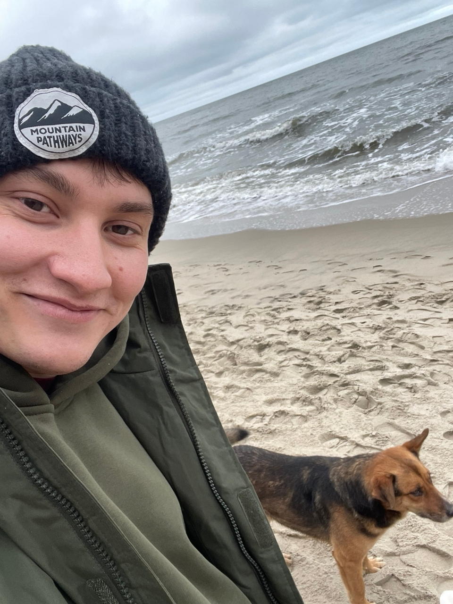

# Евгений Перевозчиков 

## Основная информация:
* Возраст: 29 лет

* Образование: Высшее (бакалавр)

* ВУЗ: ИжГСХА (Ижевская государственная сельскохозяйственная академия УдГАУ)
Факультет: Энергетики и электрификации

## Профессиональный путь и развитие:
В настоящее время моя профессиональная жизнь находится в активной фазе трансформации и развития:
1. Текущая сфера деятельности: Работаю в области энергообеспечения предприятий. Это практическая область, где применимы знания, полученные в вузе, и требуются ответственность, технический склад ума и понимание комплексных систем.
2. Обучение и цель: Прохожу курс на инженера по тестированию (QA Engineer). Это осознанный шаг в сторону IT-индустрии, который позволяет совместить технические навыки, аналитическое мышление и внимание к деталям с перспективами цифровой экономики.
   
   ## Интересы и хобби:
   Одним из главных источников вдохновения и отдыха для меня являются прогулки по морскому пляжу с собаками. Это сочетание любви к животным, природе и морю, которое помогает перезагрузиться и найти баланс.
